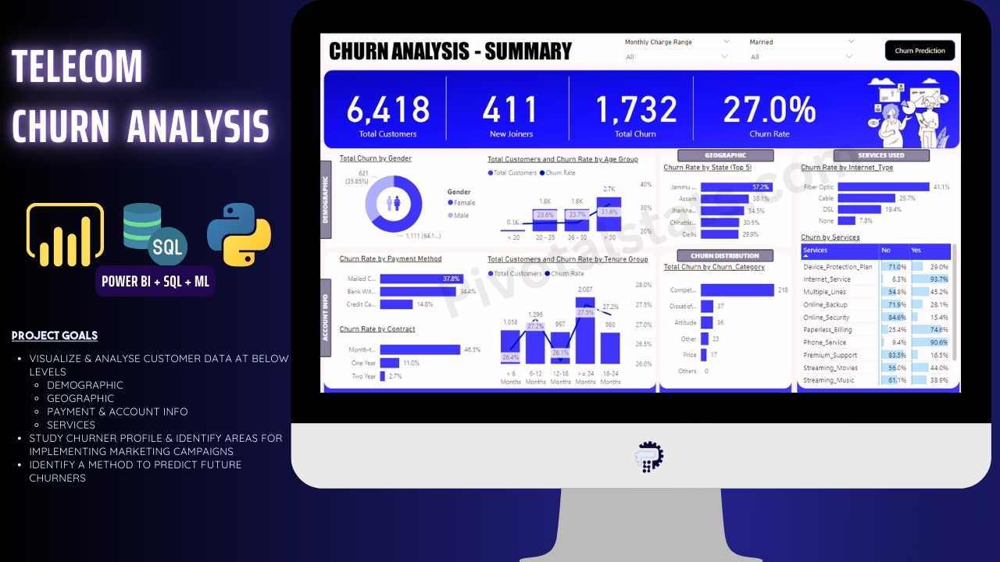
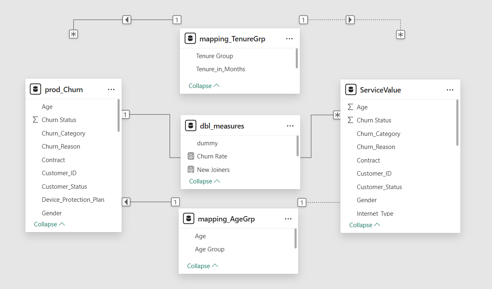
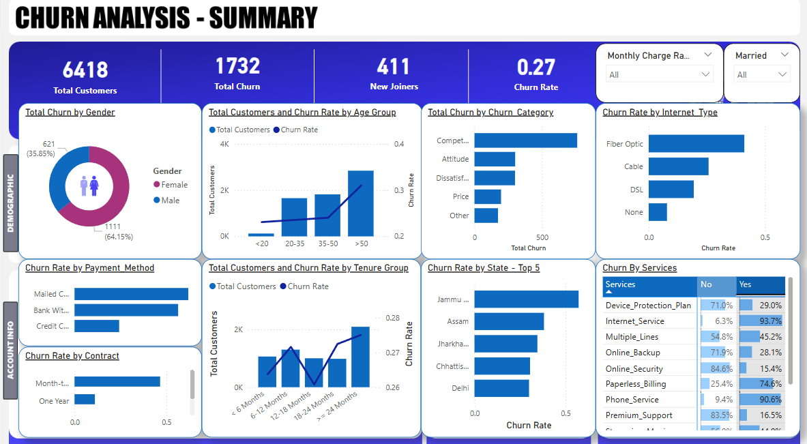
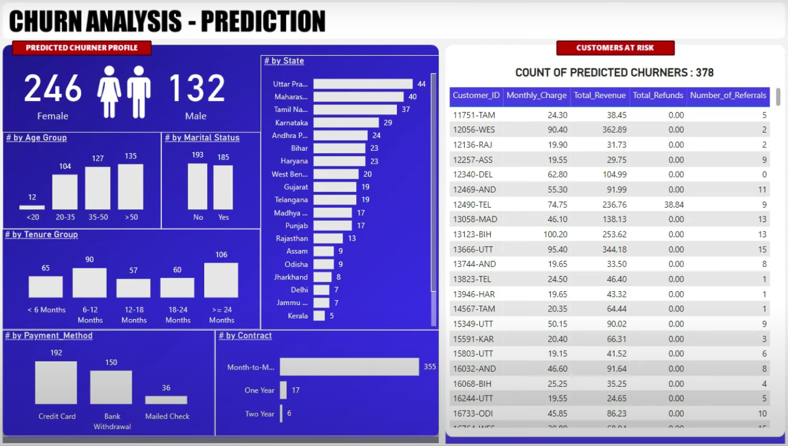

# 🔍 Customer Churn & Predictive Analysis

> A full-stack data analytics solution to understand customer churn patterns and forecast churn probability using machine learning. This project integrates data engineering, exploratory analysis, and predictive modeling into a powerful visual and analytical story using **Python**, **MySQL**, **Excel**, **Power BI**, and **Random Forest Classifier**.

---

## 📌 Table of Contents

- [📊 Project Overview](#-project-overview)
- [🧱 Data Model](#-data-model)
- [📈 Power BI Dashboards](#-power-bi-dashboards)
- [🤖 Predictive Analysis](#-predictive-analysis)
- [🛠️ Tech Stack](#-tech-stack)

---

## 📊 Project Overview

Customer churn is a major concern for subscription-based and service-driven businesses. This project identifies key factors that influence churn and leverages machine learning to predict potential churners, enabling businesses to take proactive steps.

Key goals:
- Identify high-risk churn customers
- Understand behavioral and demographic drivers
- Visualize KPIs with interactive dashboards
- Predict churn with a Random Forest model

---

## 🧱 Data Model

A well-structured relational model was developed to clean and join customer, service, and usage data using **MySQL**. Below is the high-level data schema:

---

## 📈 Power BI Dashboards

An interactive Power BI dashboard showcases:
- Customer segmentation
- Churn distribution across demographics
- Usage metrics and service features
- Monthly churn trends

> Screenshot taken from interactive dashboard showing churn insights by location, tenure, and service usage.

---

## 🤖 Predictive Analysis

A **Random Forest** model was trained using Python (with Scikit-learn) to classify churn based on multiple attributes. The prediction outputs are integrated into Power BI to enable real-time **Churn Forecasting** dashboards.

**Model Performance:**
- Accuracy: `~83%`
- Feature Importance: Tenure, Contract Type, Tech Support, Internet Service

---

## 🛠️ Tech Stack

| Layer            | Tools & Technologies                |
|------------------|-------------------------------------|
| 📥 Data Storage   | MySQL, Excel                        |
| 🧹 Data Cleaning  | Python (Pandas, NumPy)              |
| 📊 Visualization  | Power BI                            |
| 🧠 ML Modeling    | Scikit-learn (Random Forest Classifier) |
| 📁 Reporting      | Power BI Embedded Reports           |

---

